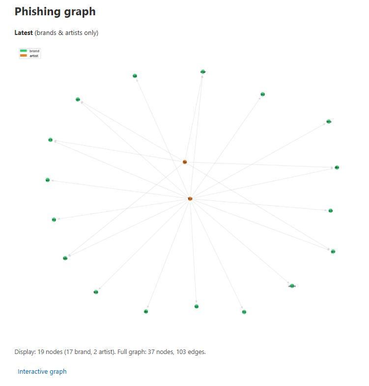
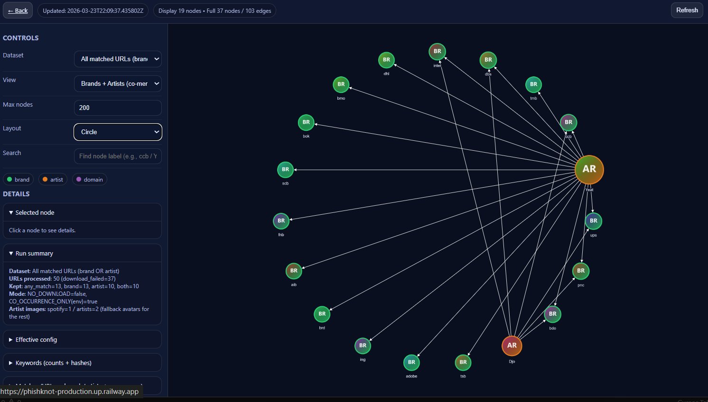

# What I Did Over Spring Break  
### (A small cybersecurity + data project — high school edition)

---

## The elevator pitch

Over spring break I built a **prototype** that connects two ideas that don’t usually show up together:

1. **Phishing** — fake login or scam pages that try to steal passwords or money.  
2. **Brands & music artists** — names scammers often abuse because people already trust them.

The program pulls **real phishing-related URLs** from public feeds, looks for **brand names** and **artist names** in the URL or page text, and builds a **graph**: who’s mentioned together, which domains show up, and how it all links up. Then there’s a **small website** where you can explore that graph interactively — zoom, drag, switch layouts, and read stats about the run.

---

## Why this is interesting (not just “because coding”)

- **Real data:** The feeds point at malicious or suspicious URLs. The app is careful about **not** blindly downloading dangerous content (configurable “safe” modes).  
- **Graphs tell stories:** A list of URLs is boring. A graph shows **patterns** — the same artist next to many brands, or domains that keep appearing.  
- **It’s visual:** You can open the same data in **Gephi** (a desktop graph tool) using the **GEXF** files the pipeline exports.
- **It's built using Cursor:** My employer is evaluating **Cursor** and I wanted to get familiar.

---

## What I actually built

| Piece | What it does |
|--------|----------------|
| **Pipeline** (`phishing_brand_graph.py`) | Fetches feeds, matches keywords, talks to Last.fm / Spotify for artist metadata, writes SQLite history, exports CSV + GEXF + JSON summaries. |
| **Web app** (`app.py`) | Serves the interactive graph (Cytoscape.js), run stats, keywords, and “match provenance” (was the match in the URL vs. page text?). |
| **Deploy notes** | Railway / Docker docs so it can run in the cloud with a persistent disk for the database. |

---

## Screenshots

**Static graph** — rendered / exported view of the graph (good for slides or print):

**Interactive web view** — live app in the browser: pan, zoom, layout dropdown, run summary, and details panels:

**Live URLs:**

- Main static page: [https://phishknot-production.up.railway.app/](https://phishknot-production.up.railway.app/)
- Interactive page: [https://phishknot-production.up.railway.app/graph/interactive](https://phishknot-production.up.railway.app/graph/interactive)

---

## One real run (example numbers)

Your numbers will change every time; here’s **one** snapshot to show what the UI means:

- **Dataset:** Co-occurrence only (URLs where **both** a brand **and** an artist matched).  
- **URLs processed:** 50  
- **Download failures:** 42 (many phishing URLs are dead, blocked, or don’t respond — that’s normal).  
- **Kept after filters:** 8 URLs with any match; 7 had **both** brand and artist.  
- **Artist images from Spotify:** 1 out of 2 artists in the graph (the rest use **generated avatar** images — colored initials).  
- **Modes:** `NO_DOWNLOAD` can be toggled for safety; `CO_OCCURRENCE_ONLY` makes the graph **stricter** (fewer nodes, but clearer “both matched” stories).

---

## Tech I used (plain English)

- **Python** — glue code, graph math (**NetworkX**), talking to APIs.  
- **Flask** — tiny web server for the UI and JSON APIs.  
- **SQLite** — remember which URLs we already saw so we don’t redo work forever.  
- **JavaScript + Cytoscape.js** — draw the graph in the browser, pan/zoom, layouts (circle, grid, force-directed, etc.).  
- **GEXF** — interchange format for tools like Gephi.

---

## Challenges I hit (honest version)

1. **The graph looked “stuck”** — filters like co-occurrence-only and download failures meant **very few** URLs survived. Understanding *why* the numbers were small was part of debugging.  
2. **Interactive UI bugs** — empty image URLs broke the graph library; we fixed that with fallbacks and safer layout refresh.  
3. **Node images** — Spotify’s CDN doesn’t always play nicely with **canvas** + CORS in the browser, so the server can **proxy** those images so they actually paint on the graph.  
4. **Ethics & safety** — this project is for **research / education**. I’m not helping attackers; I’m using public feeds and defensive habits (optional no-download mode, no credential harvesting).

---

## What I learned

- How **open data feeds** (e.g. phishing URL lists) get used in security tooling.  
- That **graphs** are a legit way to explore relationships in messy text + URLs.  
- That **shipping a UI** (even a small one) forces you to handle edge cases — empty data, bad networks, browser quirks.  
- That **writing down what you built** (like this doc!) helps for portfolios, science fairs, and future you.
- That **Cursor** is not **IntelliJ** but does have an awesome coding agent in front. It approaches things in a very safe and professional manner. I am not sure how it will work with complex **Spring Boot Java**, but for PHP, Python and scripting it is solid. 
---

## If you want to run it yourself

See **[README.md](README.md)** for the short version, and **[RAILWAY.md](RAILWAY.md)** / **[DOCKER.md](DOCKER.md)** if you deploy it.

---

## What’s next (ideas)

- Thumbnails from **safe** page images (with a lot more caution and design).  
- Better explanations in the UI for **why** a URL was kept or dropped.  
- Stronger tests and a cleaner “one command” demo mode with **synthetic** data so you don’t need live phishing feeds to show the project at school.

---

*Written in a “what I did over spring break” style on purpose — tweak the numbers and stories to match your own run.*
